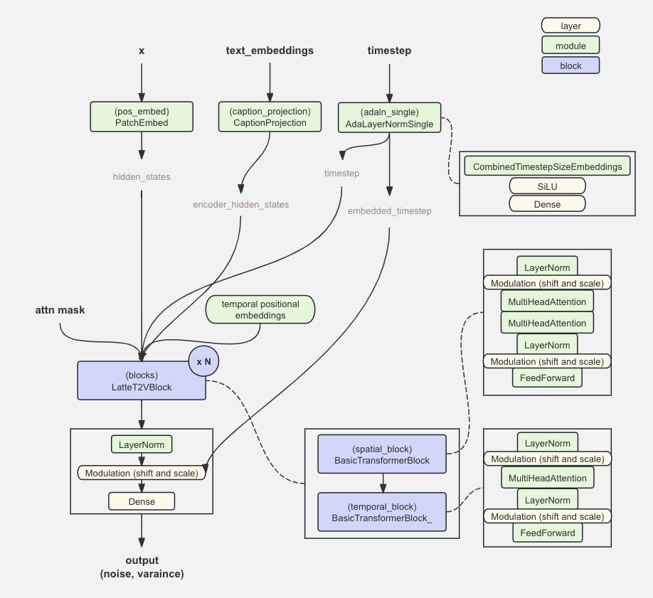
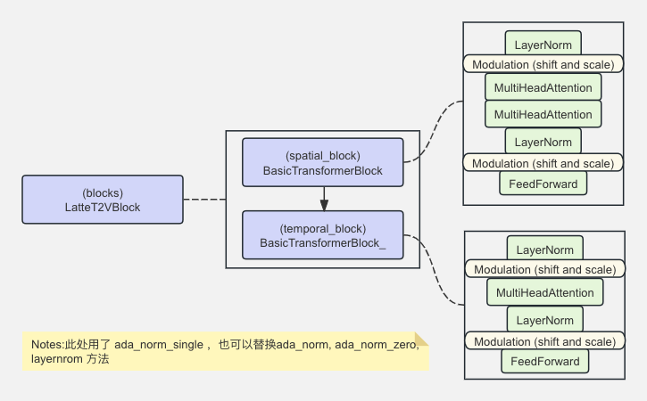
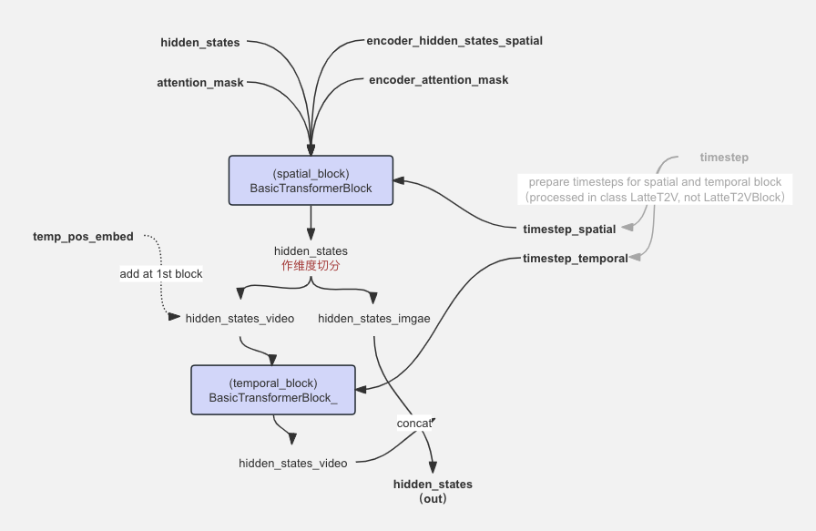

# LatteT2V 简介与 MindSpore 实现

本文介绍如何使用 Mindspore 在 Ascend 910* 上从零到一构建 OpenSora-PKU 中用到的 Latte 文生视频的噪声预测模型，主要代码参考自mindone套件[opensora-pku](https://github.com/mindspore-lab/mindone/tree/master/examples/opensora_pku/opensora/models/diffusion/latte)里的 Latte 实现。

## 1. Latte T2V 结构简介

[Latte: Latent Diffusion Transformer for Video Generation](https://arxiv.org/abs/2401.03048) 是以隐空间视频 transformer 为骨干的扩散模型，能有效地捕捉视频中的时空信息，扩展到文本到视频生成（T2V）任务后取得了一定效果。 原论文从分解输入视频的空间、时间维度的角度，提出 Latte 的4种变体，OpenSora-PKU 使用的 LatteT2V 主要参考了其中的时空交错式设计： Transformer 骨干由空间 transformer block 与时间 transformer block 交替进行。另外，Latte 使用了图像-视频联合训练进行学习， 可提升生成视频的质量。

LatteT2V 网络的整体代码结构如下，我们将逐一展开Mindspore实现:



## 2. Latte T2V Mindspore 代码实现


```python
import logging
import numbers
import os
from typing import Any, Dict, Optional, Tuple
import numpy as np

import mindspore as ms
from mindspore import Parameter, nn, ops
from mindspore.common.initializer import initializer

from mindone.diffusers.configuration_utils import ConfigMixin, register_to_config
from mindone.diffusers.models.modeling_utils import ModelMixin

logger = logging.getLogger(__name__)
```

### 2.1 modules 搭建

按照第 1 小节的结构图，首先构建 Latte 使用到的 modules 或者 与位置计算相关的函数。 可简单分为 `position utils`, `embeddings/conditions`, `normalization` 与 `attentions` 4类。

* position utils - 三角函数位置编码
    * get_1d_sincos_pos_embed ✔️
    * get_2d_sincos_pos_embed ✔️

* embeddings / conditions - 条件嵌入层
    * PatchEmbed ✔️
    * CombinedTimestepSizeEmbeddings ✔️
    * CaptionProjection ✔️

* normalization - 归一化层
    * LayerNorm ✔️
    * AdaLayerNorm ✔️

* attentions - 注意力机制
    * MultiHeadAttention  ✔️
    * FeedForward  ✔️

#### 2.1.1 position utils - 位置编码函数

定义相对位置编码函数，其中`mindone.diffusers` 中定义好的可直接复用。位置编码函数将参与图块嵌入 `PatchEmbed` 以及时间位置嵌入 `temp_pos_embed` 的计算。


```python
from mindone.diffusers.models.embeddings import get_1d_sincos_pos_embed_from_grid, get_2d_sincos_pos_embed

def get_1d_sincos_pos_embed(embed_dim, length, interpolation_scale=1.0, base_size=16):
    pos = np.arange(0, length)[:, None] / interpolation_scale
    pos_embed = get_1d_sincos_pos_embed_from_grid(embed_dim, pos)
    return pos_embed
```

#### 2.1.2 normalization - 归一化

* LayerNorm 

    层归一化, 适用于层间信息交互。


```python
class LayerNorm(nn.Cell):
    def __init__(self, normalized_shape, eps=1e-5, elementwise_affine: bool = True, dtype=ms.float32):
        super().__init__()
        if isinstance(normalized_shape, numbers.Integral):
            normalized_shape = (normalized_shape,)
        self.normalized_shape = tuple(normalized_shape)
        self.eps = eps
        self.elementwise_affine = elementwise_affine
        if self.elementwise_affine:
            self.gamma = Parameter(initializer("ones", normalized_shape, dtype=dtype))
            self.beta = Parameter(initializer("zeros", normalized_shape, dtype=dtype))
        else:
            self.gamma = ops.ones(normalized_shape, dtype=dtype)
            self.beta = ops.zeros(normalized_shape, dtype=dtype)
        self.layer_norm = ops.LayerNorm(-1, -1, epsilon=eps)

    def construct(self, x: ms.Tensor):
        oridtype = x.dtype
        x, _, _ = self.layer_norm(x.to(ms.float32), self.gamma.to(ms.float32), self.beta.to(ms.float32))
        return x.to(oridtype)
```

* AdaLayerNormSingle

    由 [PixArt-Alpha](https://arxiv.org/abs/2310.00426) 提出的节省参数量的方法，关键点为替代 DiT 的自适应标准化层（adaLN）中的占了27%参数量的线性投影层（MLP）。`AdaLayerNormSingle` 仅使用时间特征嵌入为输入，单独控制尺度和位移参数（scale and shift），在所有层共享。每一层又单独设置了可学习的特征嵌入，自适应调节不同层中的尺度和位移参数，可见后面 `BasicTransformerBlock_`, `BasicTransformerBlock`  中的 `self.scale_shift_table`。

    备注: 时间特征嵌入层 `CombinedTimestepSizeEmbeddings` 的实现见 2.1.3 的嵌入模块构建。


```python
class AdaLayerNormSingle(nn.Cell):
    r"""
    Norm layer adaptive layer norm single (adaLN-single).

    As proposed in PixArt-Alpha (see: https://arxiv.org/abs/2310.00426; Section 2.3).

    Parameters:
        embedding_dim (`int`): The size of each embedding vector.
        use_additional_conditions (`bool`): To use additional conditions for normalization or not.
    """

    def __init__(self, embedding_dim: int, use_additional_conditions: bool = False):
        super().__init__()

        self.emb = CombinedTimestepSizeEmbeddings(
            embedding_dim, size_emb_dim=embedding_dim // 3, use_additional_conditions=use_additional_conditions
        )

        self.silu = nn.SiLU()
        self.linear = nn.Dense(embedding_dim, 6 * embedding_dim)

    def construct(
        self,
        timestep: ms.Tensor,
        added_cond_kwargs: Dict[str, ms.Tensor] = None,
        batch_size: int = None,
        hidden_dtype=None,
    ) -> Tuple[ms.Tensor, ms.Tensor, ms.Tensor, ms.Tensor, ms.Tensor]:
        # No modulation happening here.
        embedded_timestep = self.emb(
            timestep, batch_size=batch_size, hidden_dtype=hidden_dtype, resolution=None, aspect_ratio=None
        )
        return self.linear(self.silu(embedded_timestep)), embedded_timestep

```

#### 2.1.3 embeddings - 嵌入层


```python
from mindone.diffusers.models.embeddings import TimestepEmbedding, Timesteps
```

* PatchEmbed

    将图像分块，使用卷积后再平铺（相对直接使用线性映射层可提升效率）；最后通过直接加上位置嵌入使得模型注入`patches` 在图像中的位置信息。


```python
class PatchEmbed(nn.Cell):
    """2D Image to Patch Embedding"""

    def __init__(
        self,
        height=224,
        width=224,
        patch_size=16,
        in_channels=3,
        embed_dim=768,
        layer_norm=False,
        flatten=True,
        bias=True,
        interpolation_scale=1,
    ):
        super().__init__()

        num_patches = (height // patch_size) * (width // patch_size)
        self.flatten = flatten
        self.layer_norm = layer_norm

        self.proj = nn.Conv2d(in_channels, embed_dim, kernel_size=patch_size, stride=patch_size, has_bias=bias)
        if layer_norm:
            self.norm = LayerNorm(embed_dim, elementwise_affine=False, eps=1e-6)
        else:
            self.norm = None

        self.patch_size = patch_size
        # See:
        # https://github.com/PixArt-alpha/PixArt-alpha/blob/0f55e922376d8b797edd44d25d0e7464b260dcab/diffusion/model/nets/PixArtMS.py#L161
        self.height, self.width = height // patch_size, width // patch_size
        self.base_size = height // patch_size
        self.interpolation_scale = interpolation_scale
        pos_embed = get_2d_sincos_pos_embed(
            embed_dim, int(num_patches**0.5), base_size=self.base_size, interpolation_scale=self.interpolation_scale
        )
        self.pos_embed = ms.Parameter(ms.Tensor(pos_embed).float().unsqueeze(0), requires_grad=False)

    def construct(self, latent):
        height, width = latent.shape[-2] // self.patch_size, latent.shape[-1] // self.patch_size

        latent = self.proj(latent)
        if self.flatten:
            latent = latent.flatten(start_dim=2).permute(0, 2, 1)  # BCHW -> BNC
        if self.layer_norm:
            latent = self.norm(latent)

        # Interpolate positional embeddings if needed.
        # (For PixArt-Alpha: https://github.com/PixArt-alpha/PixArt-alpha/\
        # blob/0f55e922376d8b797edd44d25d0e7464b260dcab/diffusion/model/nets/PixArtMS.py#L162C151-L162C160)
        if self.height != height or self.width != width:
            pos_embed = get_2d_sincos_pos_embed(
                embed_dim=self.pos_embed.shape[-1],
                grid_size=(height, width),
                base_size=self.base_size,
                interpolation_scale=self.interpolation_scale,
            )
            pos_embed = ms.Tensor(pos_embed)
            pos_embed = pos_embed.float().unsqueeze(0)
        else:
            pos_embed = self.pos_embed

        return (latent + pos_embed).to(latent.dtype)
```

* CombinedTimestepSizeEmbeddings

    计算`AdaLayerNormSingle` 中使用的时间特征嵌入。
    
    其中， `use_additional_conditions` 设为 `True` 时，模块会同时结合分辨率、纵横比等图像或视频的尺寸信息计算条件嵌入，与时间戳 `timestep` 共同控制 transformer blocks 的尺度和位移参数。该模块的关于 size 的输入（ `resolution`, `aspect_ratio`, `batch_size`, `hidden_dtype` ）通过 `LatteT2V` 网络的 `added_cond_kwargs` 字典传过来。


```python
class CombinedTimestepSizeEmbeddings(nn.Cell):
    """
    For PixArt-Alpha.

    Reference:
    https://github.com/PixArt-alpha/PixArt-alpha/blob/0f55e922376d8b797edd44d25d0e7464b260dcab/diffusion/model/nets/PixArtMS.py#L164C9-L168C29
    """

    def __init__(self, embedding_dim, size_emb_dim, use_additional_conditions: bool = False):
        super().__init__()

        self.outdim = size_emb_dim
        self.time_proj = Timesteps(num_channels=256, flip_sin_to_cos=True, downscale_freq_shift=0)
        self.timestep_embedder = TimestepEmbedding(in_channels=256, time_embed_dim=embedding_dim)

        self.use_additional_conditions = use_additional_conditions
        if use_additional_conditions:
            self.use_additional_conditions = True
            self.additional_condition_proj = Timesteps(num_channels=256, flip_sin_to_cos=True, downscale_freq_shift=0)
            self.resolution_embedder = TimestepEmbedding(in_channels=256, time_embed_dim=size_emb_dim)
            self.aspect_ratio_embedder = TimestepEmbedding(in_channels=256, time_embed_dim=size_emb_dim)

    def apply_condition(self, size: ms.Tensor, batch_size: int, embedder: nn.Cell):
        if size.ndim == 1:
            size = size[:, None]

        if size.shape[0] != batch_size:
            size = size.repeat_interleave(batch_size // size.shape[0], 1)
            if size.shape[0] != batch_size:
                raise ValueError(f"`batch_size` should be {size.shape[0]} but found {batch_size}.")

        current_batch_size, dims = size.shape[0], size.shape[1]
        size = size.reshape(-1)
        size_freq = self.additional_condition_proj(size).to(size.dtype)

        size_emb = embedder(size_freq)
        size_emb = size_emb.reshape(current_batch_size, dims * self.outdim)
        return size_emb

    def construct(self, timestep, resolution, aspect_ratio, batch_size, hidden_dtype):
        timesteps_proj = self.time_proj(timestep)
        timesteps_emb = self.timestep_embedder(timesteps_proj.to(dtype=hidden_dtype))  # (N, D)

        if self.use_additional_conditions:
            resolution = self.apply_condition(resolution, batch_size=batch_size, embedder=self.resolution_embedder)
            aspect_ratio = self.apply_condition(
                aspect_ratio, batch_size=batch_size, embedder=self.aspect_ratio_embedder
            )
            conditioning = timesteps_emb + ops.cat([resolution, aspect_ratio], axis=1)
        else:
            conditioning = timesteps_emb

        return conditioning
```

* CaptionProjection

    输入 transformer blocks 前对文本嵌入做 projection。输入的 `caption` 已经是经过 T5 text encoder 的 embeddings，因此这里没有对文本tokens的dropout。


```python
class CaptionProjection(nn.Cell):
    """
    Projects caption embeddings.

        """

    def __init__(self, in_features, hidden_size, num_tokens=120):
        super().__init__()
        self.linear_1 = nn.Dense(in_features, hidden_size)
        self.act_1 = nn.GELU(True)
        self.linear_2 = nn.Dense(hidden_size, hidden_size)

    def construct(self, caption, force_drop_ids=None):
        hidden_states = self.linear_1(caption)
        hidden_states = self.act_1(hidden_states)
        hidden_states = self.linear_2(hidden_states)
        return hidden_states
```

#### 2.1.4 Attentions - 注意力机制


* MultiHeadAttention

    `Attention`, `FlashAttention`, `MultiHeadAttention` 的实现细节可参考教程 [注意力机制的 MindSpore 实现]() （TODO）。这里我们先直接加载 mindone 套件里 opensora_pku 的 `MultiHeadAttention`。


```python
from examples.opensora_pku.opensora.models.diffusion.latte.modules import MultiHeadAttention
```

* FeedForward

    `FeedForward` 一般作为 transformer block 最后的组件： `MultiHeadAttention` 的输出，最后过一下 非线性激活层 + dropout + 线性变换层 + final dropout (optional)， 可深化特征提取与加速收敛。激活层可复用 `mindone.diffusers` 组件。


```python
from mindone.diffusers.models.activations import GEGLU, GELU, ApproximateGELU
class FeedForward(nn.Cell):
    r"""
    A feed-forward layer.
    
    """

    def __init__(
        self,
        dim: int,
        dim_out: Optional[int] = None,
        mult: int = 4,
        dropout: float = 0.0,
        activation_fn: str = "geglu",
        final_dropout: bool = False,
    ):
        super().__init__()
        inner_dim = int(dim * mult)
        dim_out = dim_out if dim_out is not None else dim
        linear_cls = nn.Dense

        if activation_fn == "gelu":
            act_fn = GELU(dim, inner_dim)
        if activation_fn == "gelu-approximate":
            act_fn = GELU(dim, inner_dim, approximate="tanh")
        elif activation_fn == "geglu":
            act_fn = GEGLU(dim, inner_dim)
        elif activation_fn == "geglu-approximate":
            act_fn = ApproximateGELU(dim, inner_dim)

        self.net = nn.CellList([])
        # project in
        self.net.append(act_fn)
        # project dropout
        self.net.append(nn.Dropout(p=dropout))
        # project out
        self.net.append(linear_cls(inner_dim, dim_out))
        # FF as used in Vision Transformer, MLP-Mixer, etc. have a final dropout
        if final_dropout:
            self.net.append(nn.Dropout(p=dropout))

    def construct(self, hidden_states: ms.Tensor, scale: float = 1.0) -> ms.Tensor:
        compatible_cls = GEGLU
        for module in self.net:
            if isinstance(module, compatible_cls):
                hidden_states = module(hidden_states, scale)
            else:
                hidden_states = module(hidden_states)
        return hidden_states
```

### 2.2 LatteT2VBlock 搭建

有了 `norm`, `MultiHeadAttention` 与  `FeedForward` 模块，我们已经可以构建 transformer blocks 。OpenSora-PKU 的 LatteT2V 空间 transformer block 与时间 transformer block 交替进行，组成一个 `LatteT2VBlock`。 


* TransformerBlocks
    * `BasicTransformerBlock` - 空间
    * `BasicTransformerBlock_` - 时间

* `LatteT2VBlock`

下图展示了 mindone 仓中 OpenSora-PKU  `LatteT2VBlock` 默认配置下的结构：



备注：TransformerBlocks 中的归一化层除了 `ada_norm_single` 还可以使用其他归一化配置，如 `layer_norm`, `ada_norm`, `ada_norm_zero`, `ada_norm_single`, mindone 仓完整版实现通过`norm_type` 参数控制，对应 block 内的计算也会有所调整。mindone 仓的 TransformerBlocks 还支持 [GLIGEN: Open-Set Grounded Text-to-Image Generation](https://arxiv.org/abs/2301.07093)方法, 通过 TransformerBlocks 初始化参数 `attention_type = gated` 打开，并在`construct` 的入参： `cross_attention_kwargs` 字典里的`gligen_kwargs["objs"]` 传递定位指令（生成图片/视频的附加信息），使得 GLIGEN Control 生效。

本教程只展示 OpenSora-PKU 默认配置默认配置中的实现，且对代码做了提炼简化。

* BasicTransformerBlock (spatial_block)

    空间 block : Norm + MultiHeadAttention  + MultiHeadAttention + Norm + FeedFoward，其中第一个 MHA 为 self-attention，第二个 MHA 为 cross-attention，文本的 hidden_states 也参与计算。`construct` 的输入 `timestep` 在使用 `ada_norm_single`计算 modulation 的 shift 和 scale 参数时使用。

```python
class BasicTransformerBlock(nn.Cell):
    r"""
    A basic Transformer block. for spatial_block
    """

    def __init__(
        self,
        dim: int,
        num_attention_heads: int,
        attention_head_dim: int,
        dropout=0.0,
        cross_attention_dim: Optional[int] = None,
        activation_fn: str = "geglu",
        attention_bias: bool = False,
        only_cross_attention: bool = False,
        double_self_attention: bool = False,
        upcast_attention: bool = False,
        norm_elementwise_affine: bool = True,
        norm_type: str = "ada_norm_single",  # 'ada_norm', 'ada_norm_zero', 'ada_norm_single'
        norm_eps: float = 1e-5,
        final_dropout: bool = False,
        attention_type: str = "default", #  "default", "gated", "gated-text-image"
        enable_flash_attention: bool = False,
    ):
        super().__init__()
        self.only_cross_attention = only_cross_attention

        self.use_ada_layer_norm_single = norm_type == "ada_norm_single"
        assert self.use_ada_layer_norm_single, "NotImplementedError: please refer to the mindone OpenSora-PKU repo"

        self.norm1_ln = LayerNorm(dim, elementwise_affine=norm_elementwise_affine, eps=norm_eps)

        # 1. Self-Attn
        self.attn1 = MultiHeadAttention(
            query_dim=dim,
            heads=num_attention_heads,
            dim_head=attention_head_dim,
            dropout=dropout,
            bias=attention_bias,
            cross_attention_dim=cross_attention_dim if only_cross_attention else None,
            upcast_attention=upcast_attention,
            enable_flash_attention=enable_flash_attention,
        )

        # 2. Cross-Attn
        if cross_attention_dim is not None or double_self_attention:
            self.norm2_ln = LayerNorm(dim, elementwise_affine=norm_elementwise_affine, eps=norm_eps)
            self.attn2 = MultiHeadAttention(
                query_dim=dim,
                cross_attention_dim=cross_attention_dim if not double_self_attention else None,
                heads=num_attention_heads,
                dim_head=attention_head_dim,
                dropout=dropout,
                bias=attention_bias,
                upcast_attention=upcast_attention,
                enable_flash_attention=enable_flash_attention,
            )  # is self-attn if encoder_hidden_states is none
        else:
            self.norm2 = None
            self.attn2 = None

        # 3. Feed-forward
        self.norm3 = LayerNorm(dim, elementwise_affine=norm_elementwise_affine, eps=norm_eps)
        self.ff = FeedForward(
            dim,
            dropout=dropout,
            activation_fn=activation_fn,
            final_dropout=final_dropout,
        )

        # Scale-shift for PixArt-Alpha.
        if self.use_ada_layer_norm_single:
            self.scale_shift_table = ms.Parameter(ops.randn(6, dim) / dim**0.5)

        # let chunk size default to None
        self._chunk_size = None
        self._chunk_dim = 0

    def construct(
        self,
        hidden_states: ms.Tensor,
        attention_mask: Optional[ms.Tensor] = None,
        encoder_hidden_states: Optional[ms.Tensor] = None,
        encoder_attention_mask: Optional[ms.Tensor] = None,
        timestep: Optional[ms.Tensor] = None, 
        cross_attention_kwargs: Dict[str, Any] = None,
        class_labels: Optional[ms.Tensor] = None,
    ) -> ms.Tensor:
        
        # 1. Retrieve lora scale.
        lora_scale = cross_attention_kwargs.get("scale", 1.0) if cross_attention_kwargs is not None else 1.0
        
        # Notice that normalization is always applied before the real computation in the following blocks.
        batch_size = hidden_states.shape[0]
        gate_msa, shift_mlp, scale_mlp, gate_mlp = None, None, None, None

        shift_msa, scale_msa, gate_msa, shift_mlp, scale_mlp, gate_mlp = (
            self.scale_shift_table[None] + timestep.reshape(batch_size, 6, -1)
        ).chunk(6, axis=1)
        norm_hidden_states = self.norm1_ln(hidden_states)
        norm_hidden_states = norm_hidden_states * (1 + scale_msa) + shift_msa
            
        # 2. self-Attention
        attn_output = self.attn1(
            norm_hidden_states,
            encoder_hidden_states=encoder_hidden_states if self.only_cross_attention else None,
            attention_mask=attention_mask,
            **cross_attention_kwargs,
        )
        
        attn_output = gate_msa * attn_output
        hidden_states = attn_output + hidden_states
        if hidden_states.ndim == 4:
            hidden_states = hidden_states.squeeze(1)

        # 3. Cross-Attention
        if self.attn2 is not None:

            # norm_hidden_states = self.norm2_ln(hidden_states)
            # use_ada_layer_norm_single, for PixArt norm2 isn't applied here
            norm_hidden_states = hidden_states

            attn_output = self.attn2(
                norm_hidden_states,
                encoder_hidden_states=encoder_hidden_states,
                attention_mask=encoder_attention_mask,
                **cross_attention_kwargs,
            )
            hidden_states = attn_output + hidden_states

        # 4. Feed-forward
        # use_ada_layer_norm_single
        norm_hidden_states = self.norm2_ln(hidden_states)
        norm_hidden_states = norm_hidden_states * (1 + scale_mlp) + shift_mlp

        ff_output = self.ff(norm_hidden_states, scale=lora_scale)

        # use_ada_layer_norm_single
        ff_output = gate_mlp * ff_output

        hidden_states = ff_output + hidden_states
        if hidden_states.ndim == 4:
            hidden_states = hidden_states.squeeze(1)

        return hidden_states
```

* BasicTransformerBlock_ (temporal_block)

    时间 transformer block : Norm + MultiHeadAttention + Norm + FeedFoward。 相比空间 transformer block 少了第二个 MHA， 只用了 self-attention 。


```python
class BasicTransformerBlock_(nn.Cell):
    r"""
    A basic Transformer block. for temporal_block

    """

    def __init__(
        self,
        dim: int,
        num_attention_heads: int,
        attention_head_dim: int,
        dropout=0.0,
        cross_attention_dim: Optional[int] = None,
        activation_fn: str = "geglu",
        attention_bias: bool = False,
        only_cross_attention: bool = False,
        double_self_attention: bool = False,
        upcast_attention: bool = False,
        norm_elementwise_affine: bool = True,
        norm_type: str = "ada_norm_single",  # 'layer_norm', 'ada_norm', 'ada_norm_zero', 'ada_norm_single'
        norm_eps: float = 1e-5,
        final_dropout: bool = False,
        attention_type: str = "default", #  "default", "gated", "gated-text-image"
        enable_flash_attention: bool = False,
    ):
        super().__init__()
        self.only_cross_attention = only_cross_attention

        self.use_ada_layer_norm_single = norm_type == "ada_norm_single"
        assert self.use_ada_layer_norm_single, "NotImplementedError: please refer to the mindone OpenSora-PKU repo"
        self.norm1_ln = LayerNorm(dim, elementwise_affine=norm_elementwise_affine, eps=norm_eps)

        self.attn1 = MultiHeadAttention(
            query_dim=dim,
            heads=num_attention_heads,
            dim_head=attention_head_dim,
            dropout=dropout,
            bias=attention_bias,
            cross_attention_dim=cross_attention_dim if only_cross_attention else None,
            upcast_attention=upcast_attention,
            enable_flash_attention=enable_flash_attention,
        )

        self.norm3 = LayerNorm(dim, elementwise_affine=norm_elementwise_affine, eps=norm_eps)

        self.ff = FeedForward(dim, dropout=dropout, activation_fn=activation_fn, final_dropout=final_dropout)

        # Scale-shift for PixArt-Alpha.
        if self.use_ada_layer_norm_single:
            self.scale_shift_table = ms.Parameter(ops.randn(6, dim) / dim**0.5)
            
        # let chunk size default to None
        self._chunk_size = None
        self._chunk_dim = 0

    def construct(
        self,
        hidden_states: ms.Tensor,
        attention_mask: Optional[ms.Tensor] = None,
        encoder_hidden_states: Optional[ms.Tensor] = None,
        encoder_attention_mask: Optional[ms.Tensor] = None,
        timestep: Optional[ms.Tensor] = None,
        cross_attention_kwargs: Dict[str, Any] = None,
        class_labels: Optional[ms.Tensor] = None,
    ) -> ms.Tensor:

        # 1. Retrieve lora scale.
        lora_scale = cross_attention_kwargs.get("scale", 1.0) if cross_attention_kwargs is not None else 1.0

        # Notice that normalization is always applied before the real computation in the following blocks.
        batch_size = hidden_states.shape[0]
        gate_msa, shift_mlp, scale_mlp, gate_mlp = None, None, None, None

        shift_msa, scale_msa, gate_msa, shift_mlp, scale_mlp, gate_mlp = (
            self.scale_shift_table[None] + timestep.reshape(batch_size, 6, -1)
        ).chunk(6, axis=1)
        norm_hidden_states = self.norm1_ln(hidden_states)
        norm_hidden_states = norm_hidden_states * (1 + scale_msa) + shift_msa

        # 2. Self-Attention
        norm_hidden_states = self.norm1_ln(hidden_states)
        attn_output = self.attn1(
            norm_hidden_states,
            encoder_hidden_states=encoder_hidden_states if self.only_cross_attention else None,
            attention_mask=attention_mask,
            **cross_attention_kwargs,
        )
        attn_output = gate_msa * attn_output

        hidden_states = attn_output + hidden_states
        if hidden_states.ndim == 4:
            hidden_states = hidden_states.squeeze(1)

        # 3. Feed-forward
        #use_ada_layer_norm_single:
        norm_hidden_states = self.norm3(hidden_states)
        norm_hidden_states = norm_hidden_states * (1 + scale_mlp) + shift_mlp

        ff_output = self.ff(norm_hidden_states, scale=lora_scale)

        #use_ada_layer_norm_single:
        ff_output = gate_mlp * ff_output

        hidden_states = ff_output + hidden_states
        if hidden_states.ndim == 4:
            hidden_states = hidden_states.squeeze(1)

        return hidden_states

```

* LatteT2VBlock
  
    LatteT2VBlock 的流程图细节如下。提取空间特征的 transformer block 需要做 self-attention 与 cross-attention, 因此输入同时有视频和文本的信息。提取时间特征的  transformer block 对视频的时间特征进行学习，只做 self-attention 。 
    
    Latte 使用了图像-视频联合训练进行学习， 可提升生成视频的质量。 视频和图像生成的同时训练的实现方法是将同一数据集中随机独立采样视频帧，加到视频的末尾；`LatteT2VBlock` 的 `construct` 入参 `frame` 则表示连续视频的帧数， `use_image_num` 指的是在连续视频中采样的图片帧数，补在了视频的最后。为了不影响视频连续性的学习，与连续视频相关的内容才会被输入学习时间信息的 transformer block， 而采样图片的部分则排除在外，不参与时间模块学习。

    备注：下图最右边的 timestep 信息，在 transformer block 中使用 'ada_norm_zero' 或 'ada_norm_single' 时注入学习，用于计算 shfit and scale 参数。

    


```python
class LatteT2VBlock(nn.Cell):
    def __init__(self, block_id, temp_pos_embed, spatial_block, temp_block):
        super().__init__()
        self.spatial_block = spatial_block
        self.temp_block = temp_block
        self.is_first_block = block_id == 0
        self.temp_pos_embed = temp_pos_embed

    def construct(
        self,
        hidden_states: ms.Tensor,
        class_labels: Optional[ms.Tensor] = None,
        cross_attention_kwargs: Dict[str, Any] = None,
        attention_mask: Optional[ms.Tensor] = None,
        encoder_hidden_states_spatial: Optional[ms.Tensor] = None,
        timestep_spatial: Optional[ms.Tensor] = None,
        timestep_temp: Optional[ms.Tensor] = None,
        encoder_attention_mask: Optional[ms.Tensor] = None,
        use_image_num: int = 0,
        input_batch_size: int = 0,
        frame: int = 0,
        enable_temporal_attentions: bool = True,
    ):
        hidden_states = self.spatial_block(
            hidden_states,
            attention_mask,
            encoder_hidden_states_spatial,
            encoder_attention_mask,
            timestep_spatial,
            cross_attention_kwargs,
            class_labels,
        )

        if enable_temporal_attentions:
            # b c f h w, f = 16 + 4
            # (b f) t d -> (b t) f d
            hidden_states = hidden_states.view(input_batch_size, frame + use_image_num, -1, hidden_states.shape[-1])
            hidden_states = hidden_states.permute(0, 2, 1, 3).view(-1, frame + use_image_num, hidden_states.shape[-1])

            if use_image_num != 0 and self.training:
                hidden_states_video = hidden_states[:, :frame, ...]
                hidden_states_image = hidden_states[:, frame:, ...]
                if self.is_first_block:
                    hidden_states_video = hidden_states_video + self.temp_pos_embed

                hidden_states_video = self.temp_block(
                    hidden_states_video,
                    None,  # attention_mask
                    None,  # encoder_hidden_states
                    None,  # encoder_attention_mask
                    timestep_temp,
                    cross_attention_kwargs,
                    class_labels,
                )

                hidden_states = ops.cat([hidden_states_video, hidden_states_image], axis=1)
                # (b t) f d -> (b f) t d
                hidden_states = hidden_states.view(input_batch_size, -1, frame + use_image_num, hidden_states.shape[-1])
                hidden_states = hidden_states.permute(0, 2, 1, 3).view(
                    input_batch_size * (frame + use_image_num), -1, hidden_states.shape[-1]
                )

            else:
                if self.is_first_block:
                    hidden_states = hidden_states + self.temp_pos_embed

                hidden_states = self.temp_block(
                    hidden_states,
                    None,  # attention_mask
                    None,  # encoder_hidden_states
                    None,  # encoder_attention_mask
                    timestep_temp,
                    cross_attention_kwargs,
                    class_labels,
                )
                # (b t) f d -> (b f) t d
                hidden_states = hidden_states.view(input_batch_size, -1, frame + use_image_num, hidden_states.shape[-1])
                hidden_states = hidden_states.permute(0, 2, 1, 3).view(
                    input_batch_size * (frame + use_image_num), -1, hidden_states.shape[-1]
                )
        return hidden_states
```

### 2.3 LatteT2V 网络搭建

现在我们已经可以按照第 1 小结的结构图，构建 LatteT2V 网络。

输入：

- `hidden_states` : 经过 vae 编码的 latents， 形状为 (batch size, frame, input_channel, height, width)
- `encoder_hidden_states`: text encoder 的文本嵌入，作为 transformer blocks 的 cross-attention 的输入之一，在空间特征学习模块的第二个注意力机制模块使用；
- `attention_mask`: 应用于 `hidden_states` 的掩码。  *optional*
- `encoder_attention_mask`： 应用于 `encoder_hidden_states` 的掩码。  *optional*
- `timestep` : 扩散过程的时间戳，如果使用自适应归一化层如`AdaLayerNorm`， `AdaLayerNormSingle` ，将作为其信息注入。 *optional*
- `class_labels` : 使用类别条件引导生产时有。如果使用 `AdaLayerZeroNorm`， 将作为其信息注入。 *optional*
- `added_cond_kwargs` : 参考 `CombinedTimestepSizeEmbeddings` 构建小节， timesteps 以外的 size 信息，通过这个参数字典传入。*optional*
- `cross_attention_kwargs` : 传入 transformer blocks - cross-attention 的参数字典。*optional*
- `use_image_num`: 指 Latte 视频-图像混合训练时，从视频采样出图像的数量。

输出：

- `outout` : 形状为  (batch size, frame, output_channel, height, width), 其中 output_channel = input_channel * 2, 表示 Latte 学习/预测的 noise 与 variance。

```python
class LatteT2V(ModelMixin, ConfigMixin):
    _supports_gradient_checkpointing = True

    @register_to_config
    def __init__(
        self,
        num_attention_heads: int = 16,
        attention_head_dim: int = 72,
        in_channels: Optional[int] = None,
        out_channels: Optional[int] = None,
        num_layers: int = 1,
        dropout: float = 0.0,
        norm_num_groups: int = 32,
        cross_attention_dim: Optional[int] = None,
        attention_bias: bool = False,
        sample_size: Optional[int] = None,
        patch_size: Optional[int] = None, #2
        activation_fn: str = "geglu",
        num_embeds_ada_norm: Optional[int] = None,
        use_linear_projection: bool = False,
        only_cross_attention: bool = False,
        double_self_attention: bool = False,
        upcast_attention: bool = False,
        norm_type: str = "ada_norm_single",
        norm_elementwise_affine: bool = True,
        norm_eps: float = 1e-5,
        attention_type: str = "default",
        caption_channels: int = None,
        video_length: int = 16,
        enable_flash_attention: bool = False,
        use_recompute=False,
    ):
        super().__init__()
        self.num_attention_heads = num_attention_heads #16
        self.attention_head_dim = attention_head_dim #72
        inner_dim = num_attention_heads * attention_head_dim #1152
        self.video_length = video_length #5
        self.norm_type = norm_type #ada_norm_single
        self.use_recompute = use_recompute

        # 1. here we set the input as patches input
        self.is_input_patches = in_channels is not None and patch_size is not None #TRUE
        assert self.is_input_patches, "In this tutorial we implement patch input"


        # 2. Define input layers
        assert sample_size is not None, "Transformer2DModel over patched input must provide sample_size"

        self.height = sample_size[0] if isinstance(sample_size, (tuple, list)) else sample_size
        self.width = sample_size[1] if isinstance(sample_size, (tuple, list)) else sample_size

        self.patch_size = patch_size
        if isinstance(self.config.sample_size, (tuple, list)):
            interpolation_scale = self.config.sample_size[0] // 64  # => 64 (= 512 pixart) has interpolation scale 1
        else:
            interpolation_scale = self.config.sample_size // 64
        interpolation_scale = max(interpolation_scale, 1)
        self.pos_embed = PatchEmbed(
            height=sample_size[0] if isinstance(sample_size, (tuple, list)) else sample_size,
            width=sample_size[1] if isinstance(sample_size, (tuple, list)) else sample_size,
            patch_size=patch_size,
            in_channels=in_channels,
            embed_dim=inner_dim,
            interpolation_scale=interpolation_scale,
        )

        # 3. Define transformers blocks, spatial attention
        self.transformer_blocks = [
            BasicTransformerBlock(
                inner_dim,
                num_attention_heads,
                attention_head_dim,
                dropout=dropout,
                cross_attention_dim=cross_attention_dim,
                activation_fn=activation_fn,
                attention_bias=attention_bias,
                only_cross_attention=only_cross_attention,
                double_self_attention=double_self_attention,
                upcast_attention=upcast_attention,
                norm_type=norm_type,
                norm_elementwise_affine=norm_elementwise_affine,
                norm_eps=norm_eps,
                attention_type=attention_type,
                enable_flash_attention=enable_flash_attention,
            )
            for d in range(num_layers)
        ]

        # Define temporal transformers blocks
        self.temporal_transformer_blocks = [
            BasicTransformerBlock_(  # one attention
                inner_dim,
                num_attention_heads,  # num_attention_heads
                attention_head_dim,  # attention_head_dim 72
                dropout=dropout,
                cross_attention_dim=None,
                activation_fn=activation_fn,
                attention_bias=attention_bias,
                only_cross_attention=only_cross_attention,
                double_self_attention=False,
                upcast_attention=upcast_attention,
                norm_type=norm_type,
                norm_elementwise_affine=norm_elementwise_affine,
                norm_eps=norm_eps,
                attention_type=attention_type,
                enable_flash_attention=enable_flash_attention,
            )
            for d in range(num_layers)
        ]

        # 4. Define output layers
        self.out_channels = in_channels if out_channels is None else out_channels

        # self.is_input_patches and norm_type == "ada_norm_single":
        self.norm_out = LayerNorm(inner_dim, elementwise_affine=False, eps=1e-6)
        self.scale_shift_table = ms.Parameter(ops.randn(2, inner_dim) / inner_dim**0.5)
        self.proj_out = nn.Dense(inner_dim, patch_size * patch_size * self.out_channels)

        # 5. PixArt-Alpha blocks.
        self.adaln_single = None
        self.use_additional_conditions = False
        if norm_type == "ada_norm_single":
            self.adaln_single = AdaLayerNormSingle(inner_dim, use_additional_conditions=self.use_additional_conditions)

        # 6. caption projection
        self.caption_projection = None
        if caption_channels is not None:
            self.caption_projection = CaptionProjection(in_features=caption_channels, hidden_size=inner_dim)

        self.gradient_checkpointing = False

        # 7. define temporal positional embedding
        interpolation_scale = self.config.video_length // 5  # => 5 (= 5 our causalvideovae) has interpolation scale 1
        interpolation_scale = max(interpolation_scale, 1)
        temp_pos_embed = get_1d_sincos_pos_embed(
            inner_dim, video_length, interpolation_scale=interpolation_scale
        )  # 1152 hidden size

        self.temp_pos_embed = ms.Tensor(temp_pos_embed).float().unsqueeze(0)

        # 8. the latte T2V 
        self.blocks = nn.CellList(
            [
                LatteT2VBlock(d, self.temp_pos_embed, self.transformer_blocks[d], self.temporal_transformer_blocks[d])
                for d in range(num_layers)
            ]
        )

        if self.use_recompute:
            for block in self.blocks:
                self.recompute(block)

    def construct(
        self,
        hidden_states: ms.Tensor, # (4,4,9,32,32)
        timestep: Optional[ms.Tensor] = None, #(4,)
        encoder_hidden_states: Optional[ms.Tensor] = None, #(4,5,300,4096)
        added_cond_kwargs: Dict[str, ms.Tensor] = None,
        class_labels: Optional[ms.Tensor] = None,
        cross_attention_kwargs: Dict[str, Any] = None,
        attention_mask: Optional[ms.Tensor] = None,
        encoder_attention_mask: Optional[ms.Tensor] = None, # 4,5,300
        use_image_num: int = 0,
        enable_temporal_attentions: bool = True,
    ):

        input_batch_size, c, frame, h, w = hidden_states.shape

        frame = frame - use_image_num  # 20-4=16
        # b c f h w -> (b f) c h w
        hidden_states = hidden_states.permute(0, 2, 1, 3, 4).reshape(
            input_batch_size * (frame + use_image_num), c, h, w
        )
        if attention_mask is not None and attention_mask.ndim == 2:
            attention_mask = attention_mask.unsqueeze(1)
            attention_mask = attention_mask.to(self.dtype)
        # 1 + 4, 1 -> video condition, 4 -> image condition
        # convert encoder_attention_mask to a bias the same way we do for attention_mask
        if encoder_attention_mask is not None and encoder_attention_mask.ndim == 2:  # ndim == 2 means no image joint
            encoder_attention_mask = encoder_attention_mask.unsqueeze(1)
            # b 1 l -> (b f) 1 l
            encoder_attention_mask = encoder_attention_mask.repeat_interleave(frame, dim=0)
            encoder_attention_mask = encoder_attention_mask.to(self.dtype)
        elif encoder_attention_mask is not None and encoder_attention_mask.ndim == 3:  # ndim == 3 means image joint
            encoder_attention_mask_video = encoder_attention_mask[:, :1, ...]
            encoder_attention_mask_video = encoder_attention_mask_video.repeat_interleave(frame, dim=1)
            encoder_attention_mask_image = encoder_attention_mask[:, 1:, ...]
            encoder_attention_mask = ops.cat([encoder_attention_mask_video, encoder_attention_mask_image], axis=1)
            # b n l -> (b n) l
            encoder_attention_mask = encoder_attention_mask.view(-1, encoder_attention_mask.shape[-1]).unsqueeze(1)
            encoder_attention_mask = encoder_attention_mask.to(self.dtype)

        # 1. Input
        height, width = hidden_states.shape[-2] // self.patch_size, hidden_states.shape[-1] // self.patch_size
        num_patches = height * width

        hidden_states = self.pos_embed(hidden_states.to(self.dtype))  # alrady add positional embeddings

        if self.adaln_single is not None:
            if self.use_additional_conditions and added_cond_kwargs is None:
                raise ValueError(
                    "`added_cond_kwargs` cannot be None when using additional conditions for `adaln_single`."
                )
            # batch_size = hidden_states.shape[0]
            batch_size = input_batch_size
            timestep, embedded_timestep = self.adaln_single(
                timestep, added_cond_kwargs, batch_size=batch_size, hidden_dtype=hidden_states.dtype
            )
        else:
            embedded_timestep = None

        # 2. Blocks
        if self.caption_projection is not None:
            batch_size = hidden_states.shape[0]
            encoder_hidden_states = self.caption_projection(encoder_hidden_states.to(self.dtype))  # 3 120 1152

            if use_image_num != 0 and self.training:
                encoder_hidden_states_video = encoder_hidden_states[:, :1, ...]
                # b 1 t d -> b (1 f) t d
                encoder_hidden_states_video = encoder_hidden_states_video.repeat_interleave(frame, dim=1)
                encoder_hidden_states_image = encoder_hidden_states[:, 1:, ...]
                encoder_hidden_states = ops.cat([encoder_hidden_states_video, encoder_hidden_states_image], axis=1)
                # b f t d -> (b f) t d
                encoder_hidden_states_spatial = encoder_hidden_states.view(
                    -1, encoder_hidden_states.shape[-2], encoder_hidden_states.shape[-1]
                )
            else:
                # b t d -> (b f) t d
                encoder_hidden_states_spatial = encoder_hidden_states.repeat_interleave(frame, dim=0)
        else:
            encoder_hidden_states_spatial = encoder_hidden_states.repeat_interleave(frame, dim=0)  

        # prepare timesteps for spatial and temporal block
        # b d -> (b f) d
        timestep_spatial = timestep.repeat_interleave(frame + use_image_num, dim=0)
        # b d -> (b p) d
        timestep_temp = timestep.repeat_interleave(num_patches, dim=0)

        for block in self.blocks:
            hidden_states = block(
                hidden_states,
                class_labels,
                cross_attention_kwargs,
                attention_mask,
                encoder_hidden_states_spatial,
                timestep_spatial,
                timestep_temp,
                encoder_attention_mask,
                use_image_num,
                input_batch_size,
                frame,
                enable_temporal_attentions,
            )

        # self.norm_type == "ada_norm_single"
        # b d -> (b f) d
        assert embedded_timestep is not None, "embedded_timestep is expected to be not None"
        embedded_timestep = embedded_timestep.repeat_interleave(frame + use_image_num, dim=0)
        shift, scale = (self.scale_shift_table[None] + embedded_timestep[:, None]).chunk(2, axis=1)
        hidden_states = self.norm_out(hidden_states)
        # Modulation
        hidden_states = hidden_states * (1 + scale) + shift
        hidden_states = self.proj_out(hidden_states)

        # unpatchify
        # self.norm_type == "ada_norm_single"
        height = width = int(hidden_states.shape[1] ** 0.5)

        hidden_states = hidden_states.reshape(-1, height, width, self.patch_size, self.patch_size, self.out_channels)
        # nhwpqc->nchpwq
        hidden_states = hidden_states.permute(0, 5, 1, 3, 2, 4)
        output = hidden_states.reshape(-1, self.out_channels, height * self.patch_size, width * self.patch_size)
        # (b f) c h w -> b c f h w
        output = output.view(
            input_batch_size, frame + use_image_num, output.shape[-3], output.shape[-2], output.shape[-1]
        )
        output = output.permute(0, 2, 1, 3, 4)
        return output
```

OpenSora-PKU 使用 LatteT2V_XL_122 规格，其中 `num_layers` 表示 `LatteT2VBlock` 的个数。 


```python
def LatteT2V_XL_122(**kwargs):
    return LatteT2V(
        num_layers=28,
        attention_head_dim=72,
        num_attention_heads=16,
        patch_size=2,
        norm_type="ada_norm_single",
        caption_channels=4096,
        cross_attention_dim=1152,
        **kwargs,
    )
```

初始化一个 Latte model 并打印结构：


```python
latte_model = LatteT2V_XL_122(
    in_channels=4,
    out_channels=4 * 2,
    attention_bias=True,
    sample_size=(32, 32),
    activation_fn="gelu-approximate",
    use_linear_projection=False,
    only_cross_attention=False,
    double_self_attention=False,
    upcast_attention=False,
    norm_elementwise_affine=False,
    norm_eps=1e-6,
    attention_type="default",
    video_length=5,
)
```


```python
print(latte_model)
```

    LatteT2V<
      (pos_embed): PatchEmbed<
        (proj): Conv2d<input_channels=4, output_channels=1152, kernel_size=(2, 2), stride=(2, 2), pad_mode=same, padding=0, dilation=(1, 1), group=1, has_bias=True, weight_init=<mindspore.common.initializer.HeUniform object at 0x7f7f2f133af0>, bias_init=<mindspore.common.initializer.Uniform object at 0x7f7f2f1335e0>, format=NCHW>
        >
      (norm_out): LayerNorm<>
      (proj_out): Dense<input_channels=1152, output_channels=32, has_bias=True>
      (adaln_single): AdaLayerNormSingle<
        (emb): CombinedTimestepSizeEmbeddings<
          (time_proj): Timesteps<>
          (timestep_embedder): TimestepEmbedding<
            (linear_1): Dense<input_channels=256, output_channels=1152, has_bias=True>
            (act): SiLU<>
            (linear_2): Dense<input_channels=1152, output_channels=1152, has_bias=True>
            >
          >
        (silu): SiLU<>
        (linear): Dense<input_channels=1152, output_channels=6912, has_bias=True>
        >
      (caption_projection): CaptionProjection<
        (linear_1): Dense<input_channels=4096, output_channels=1152, has_bias=True>
        (act_1): GELU<>
        (linear_2): Dense<input_channels=1152, output_channels=1152, has_bias=True>
        >
      (blocks): CellList<
        (0): LatteT2VBlock<
          (spatial_block): BasicTransformerBlock<
            (norm1_ln): LayerNorm<>
            (attn1): MultiHeadAttention<
              (to_q): Dense<input_channels=1152, output_channels=1152, has_bias=True>
              (to_k): Dense<input_channels=1152, output_channels=1152, has_bias=True>
              (to_v): Dense<input_channels=1152, output_channels=1152, has_bias=True>
              (to_out): SequentialCell<
                (0): Dense<input_channels=1152, output_channels=1152, has_bias=True>
                (1): Dropout<p=0.0>
                >
              (attention): Attention<
                (attn_drop): Dropout<p=0.0>
                >
              >
            (norm2_ln): LayerNorm<>
            (attn2): MultiHeadAttention<
              (to_q): Dense<input_channels=1152, output_channels=1152, has_bias=True>
              (to_k): Dense<input_channels=1152, output_channels=1152, has_bias=True>
              (to_v): Dense<input_channels=1152, output_channels=1152, has_bias=True>
              (to_out): SequentialCell<
                (0): Dense<input_channels=1152, output_channels=1152, has_bias=True>
                (1): Dropout<p=0.0>
                >
              (attention): Attention<
                (attn_drop): Dropout<p=0.0>
                >
              >
            (norm3): LayerNorm<>
            (ff): FeedForward<
              (net): CellList<
                (0): GELU<
                  (proj): Dense<input_channels=1152, output_channels=4608, has_bias=True>
                  >
                (1): Dropout<p=0.0>
                (2): Dense<input_channels=4608, output_channels=1152, has_bias=True>
                >
              >
            >
          (temp_block): BasicTransformerBlock_<
            (norm1_ln): LayerNorm<>
            (attn1): MultiHeadAttention<
              (to_q): Dense<input_channels=1152, output_channels=1152, has_bias=True>
              (to_k): Dense<input_channels=1152, output_channels=1152, has_bias=True>
              (to_v): Dense<input_channels=1152, output_channels=1152, has_bias=True>
              (to_out): SequentialCell<
                (0): Dense<input_channels=1152, output_channels=1152, has_bias=True>
                (1): Dropout<p=0.0>
                >
              (attention): Attention<
                (attn_drop): Dropout<p=0.0>
                >
              >
            (norm3): LayerNorm<>
            (ff): FeedForward<
              (net): CellList<
                (0): GELU<
                  (proj): Dense<input_channels=1152, output_channels=4608, has_bias=True>
                  >
                (1): Dropout<p=0.0>
                (2): Dense<input_channels=4608, output_channels=1152, has_bias=True>
                >
              >
            >
          >
          
        ......(一共28个LatteT2VBlock)......
    
        (27): LatteT2VBlock<
        ...
        >
      >
        

## 3. 扩展阅读


