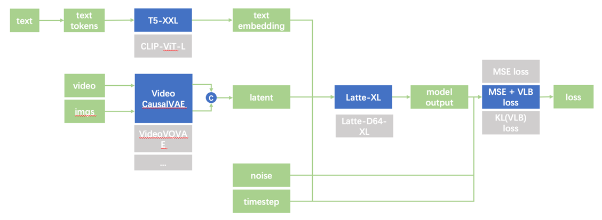

# OpenSora-PKU 从零到一实现

本文介绍如何使用 Mindspore 在 Ascend 910* 上从零到一实现 OpenSora-PKU 视频生成模型，主要代码参考自mindone套件中[opensora-pku](https://github.com/mindspore-lab/mindone/tree/master/examples/opensora_pku)实现。

### 1、基本训练流程介绍

opensora-pku v1.0 整体结构使用 `T5` 作为默认文本编码器，`VideoCausalVAE` 作为默认视频压缩模型 以及 `Latte` 作为噪声预测模型，
损失函数默认使用 `MSE loss`，训练过程采用图像、视频混合训练策略，整体流程如下图所示：



### 2、主要模块搭建

- [VideoCausalVAE 简介与 MindSpore 实现]()
- [T5-XXL 简介与 MindSpore 实现]()
- [Latte 简介与 MindSpore 实现]()
- [diffusion 过程定义]()

```python
from .opensora.models.ae.videobase.causal_vae import CausalVAEModelWrapper
from .opensora.models.text_encoder.t5 import T5Embedder
from .opensora.models.diffusion.latte.modeling_latte import LatteT2V_XL_122


vae = CausalVAEModelWrapper(
    model_config="./causal_vae_488.yaml",
    model_path="LanguageBind/Open-Sora-Plan-v1.0.0",
    subfolder="vae"
)

text_encoder = T5Embedder(
    dir_or_name="DeepFloyd/t5-v1_1-xxl",
    cache_dir="./",
    model_max_length=300,
)

latte_model = LatteT2V_XL_122(
    in_channels=4,
    out_channels=4 * 2,
    ...
)

from .opensora.models.diffusion.diffusion import create_diffusion_T as create_diffusion
diffusion = create_diffusion(timestep_respacing="")
```

### 3、训练流程搭建

#### 3.1 训练模型

```python

```


