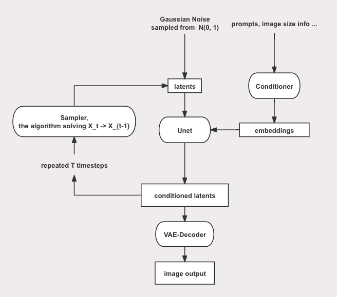

# SDXL 推理实现

本文介绍如何使用Mindspore+Ascend实现单卡SDXL-base的文生图推理。

## 1. 模型准备

SDXL推理的输入为高斯随机噪声与文本描述、图片尺寸信等信息，输入经过加载了预训练权重的模型，以及循环T步的降噪算法，生成对应图片。



如流程图所示，SDXL推理实现需要的重要元素及作用有：

1. Conditioner - 对条件信息编码，例如文本描述、图像尺寸等条件信息，条件用于引导对应图像的生成
2. U-Net - 预测噪声，可用于计算降噪后的image presentation
3. VAE (推理只需Decoder部分) - 图像解码
4. Sampler - 在隐空间逐步去噪使用的算法


按照“0-1构建SDXL教程“构建网络（此处应有url），并加载预训练权重。

按照”采样器实现教程“构造欧拉采样器（此处应有url）。


```python
import os
import numpy as np
import mindspore as ms
from mindspore import context, Tensor, nn, ops

# mindspore设置成动态图模式
context.set_context(mode=context.PYNATIVE_MODE, device_target="Ascend")
```


```python
# TODO 临时的 还要改 看sdxl构建部分和采样器教程的情况再修改

from gm.models.autoencoder import AutoencoderKLInferenceWrapper
from gm.modules.diffusionmodules.openaimodel import UNetModel
from gm.modules import GeneralConditioner
from gm.modules.diffusionmodules.sampler import EulerEDMSampler


conditioner = GeneralConditioner()
unet = UNetModel()
vae = AutoencoderKLInferenceWrapper(
    embed_dim=4,
    monitor="val/rec_loss",
    ddconfig={
        'attn_type': 'vanilla',
        'double_z': 'true',
        'z_channels': 4,
        'resolution': 256,
        'in_channels': 3,
        'out_ch': 3,
        'ch': 128,
        'ch_mult': [1, 2, 4, 4],
        'num_res_blocks': 2,
        'attn_resolutions': [],
        'dropout': 0.0,
        'decoder_attn_dtype': 'fp16',
        }
)

class DiffusionEngine(nn.Cell):
    def __init__(self, auto_prefix=True, flags=None):

        self.vae = AutoencoderKLInferenceWrapper(
            embed_dim=4,
            monitor="val/rec_loss",
            ddconfig={
                'attn_type': 'vanilla',
                'double_z': 'true',
                'z_channels': 4,
                'resolution': 256,
                'in_channels': 3,
                'out_ch': 3,
                'ch': 128,
                'ch_mult': [1, 2, 4, 4],
                'num_res_blocks': 2,
                'attn_resolutions': [],
                'dropout': 0.0,
                'decoder_attn_dtype': 'fp16',
                }
        )
        self.unet = UNetModel()
```

## 2. 推理流程实现

### 2.1 计算条件编码 - compute conditions

conditioners计算多样化的条件信息编码，用于影响生成图像的特征。conditioners的输入有：
* prompt：正向提示词，即为生成图像的文本描述。
* negative_prompt：负向提示词，表示不希望生成的内容，从而使生成结果更符合预期。可以为空。

下述条件信息为图像尺寸、图像裁剪信息，在训练时比较重要，详情请看训练篇教程讲解，推理时可以直接给默认值：
* orig_width：原始图像尺寸（宽），1024
* orig_height：原始图像尺寸（高），1024
* target_width: 目标图像尺寸（宽），1024
* target_height: 目标图像尺寸（高），1024
* crop_coords_top：图像预处理裁剪时的左上角坐标 x，推理时可以直接设定为0
* crop_coords_left：图像预处理裁剪时的左上角坐标 y， 推理时可以直接设定为0


conditioners计算得到两个字典；cond（conditional embeddings） 和 uncond（unconditional embeddings），分别对应正向引导与和负向引导图片生成的信息编码, 两者应该有相同的keys，同一个key对应的values也有相同的形状和维度。后续为了并行计算，会把uncond和cond做拼接后再喂给unet，从而避免两次前向计算。该案例把这部分实现放在了sampler的input处理步骤，详情请看采样器的实现教程。

```python
# settings
VERSION2SPECS = {
    "SDXL-base-1.0": {
        "H": 1024,
        "W": 1024,
        "C": 4, # unet in_channels
        "f": 8, 
        "is_legacy": False,
    }}
# bs = 1
num_samples = 1
version_dict = VERSION2SPECS.get("SDXL-base-1.0")
H, W, C, F = version_dict["H"], version_dict["W"], version_dict["C"], version_dict["f"]

value_dict = {
    "prompt": "Astronaut in a jungle, cold color palette, muted colors, detailed, 8k",
    "negative_prompt": "",
    "orig_width": W,
    "orig_height": H,
    "target_width": W,
    "target_height": H,
    "crop_coords_top": 0,
    "crop_coords_left": 0
}

# TODO define:get_batch 打算先把conductioner的教程定下再看
batch_cond, batch_uncond = get_batch(value_dict, num_samples)
cond, uncond = GeneralConditioner.get_unconditional_conditioning(batch_cond, batch_uncond)
```

### 2.2 初始化随机噪声 - create random noise

diffusion process开始先生成一个初始随机噪声作为latent representation的起点，这个噪声会在后面逐步降噪得到干净的latent,最后用vae解码得到图片。SDXL中默认生成的图片为1024x1204，则初始化噪声的shape为(1, 4, 1024 // 8, 1024 // 8)：其中4对应的是unet的in channels；8是SDXL中的VAE的下采样率，1024分辨率的图片经过vae模型的3个下采样层得到latent，因此latent的高和宽为1024除以2的3次方，即 1024 // 8 = 128。


```python
# create random noise
shape = (num_samples, C, H // F, W // F)
randn_noise = Tensor(np.random.randn(*shape), ms.float32)
```

初始化噪声除了使用numpy.random.randn生成随机numpy数组再转换成mindspore.Tensor，也可以直接使用mindspore的ops.randn算子生成。与numpy.random一样，mindspore可以通过设置全局随机种子固定随机性：一个固定的种子有效期只有一次，相同的随机种子会有相同的随机顺序，如需生成一样的随机变量需要重新设置同样的种子，使用案例如下：


```python
tmp_shape = (1, 2, 3)
ms.set_seed(1)
tmp_ms_1 = ops.randn(*tmp_shape)

# 相同的随机种子有相同的随机顺序
ms.set_seed(1)
tmp_ms_2 = ops.randn(*tmp_shape)
print(tmp_ms_1 == tmp_ms_2) # True

# 随机种子的有效期只有1次，保持一致变量一致需要重新设定同一个种子
tmp_ms_3 = ops.randn(*tmp_shape)
print(tmp_ms_1 == tmp_ms_3) # False
```

    [[[ True  True  True]
      [ True  True  True]]]
    [[[False False False]
      [False False False]]]


### 2.3 降噪 - denoise the imgae （latent）

降噪过程由定义好的采样器（sampler）完成。给定初始随机噪声、训练好的噪音预测模型Unet、计算好的conditions，采样器最终返回降噪后的latent representation。采样器定义了循环求解$x_t$到$x_{t-1}$的过程：在每一个timestep，用训练好的Unet预测noise residual，随后结合文本条件的引导，求解前一步的噪声样本。


该案例使用简单的ODE-solver（常微分方程求解器）为Euler采样器。使用该采样器一般需要40-50步才可以取得较好的效果。采样器已在上述准备环节初始化。


```python
# 初始化sampler
num_inference_steps = 40
sampler = EulerEDMSampler(
                num_steps=num_inference_steps,
                discretization_config=discretization_config,
                guider_config=guider_config,
                s_churn=s_churn,
                s_tmin=s_tmin,
                s_tmax=s_tmax,
                s_noise=s_noise,
                verbose=True,
            )
latents = sampler(unet, randn_noise, cond, uncond)

```

### 2.4 解码 - decode the image（latent）

最后一步，使用vae的decoder解码得到图像。

训练时为了为了控制隐空间的方差为1，VAE-Encoder得到的latents在前向扩散过程开始前做了scale操作：`z = z * scaling_factor`；解码时应先把隐空间rescale回来：`z = 1/z * scaling_factor`。关于scale操作的讨论可以参考论文[High-Resolution ImageSynthesis with Latent Diffusion Models](https://arxiv.org/abs/2112.10752) 的 4.3.2 和 D.1部分。按照SDXL训练时的配置，设定scale_factor = 0.13025。

解码后把输出从 [-1, 1] 变换到 [0, 1] 再乘255, 使用PIL把numpy图像数组转成png格式。


```python
import PIL

# sacle and decode the latent
scale_factor = 0.13025
latents = 1.0 / scale_factor * latents
image = vae.decode(latents)

# denormalize an image array to [0,1]
image = image.asnumpy()
image = np.clip((image + 1.0) / 2.0, a_min=0.0, a_max=1.0)

# save locally as png
save_path = "./outputs"
os.makedirs(os.path.join(save_path), exist_ok=True)
base_count = len(os.listdir(os.path.join(save_path)))
image = 225.0 * image.transpose(1, 2, 0)
PIL.fromarray(image.astype(np.uint8)).save(os.path.join(save_path, f"{base_count:09}.png"))
```

## 3. 扩展阅读

本文对SDXL的推理做了一个简单的实现，完整实现可参考mindone仓：
* Inference Readme：
https://github.com/mindspore-lab/mindone/blob/master/examples/stable_diffusion_xl/docs/inference.md
* Inference script：
https://github.com/mindspore-lab/mindone/blob/master/examples/stable_diffusion_xl/demo/sampling_without_streamlit.py
